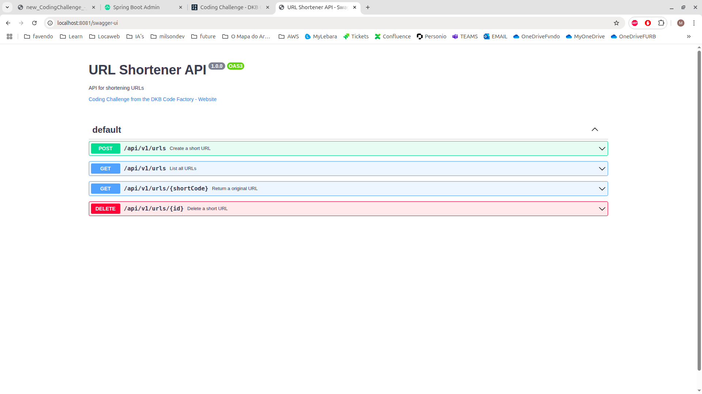
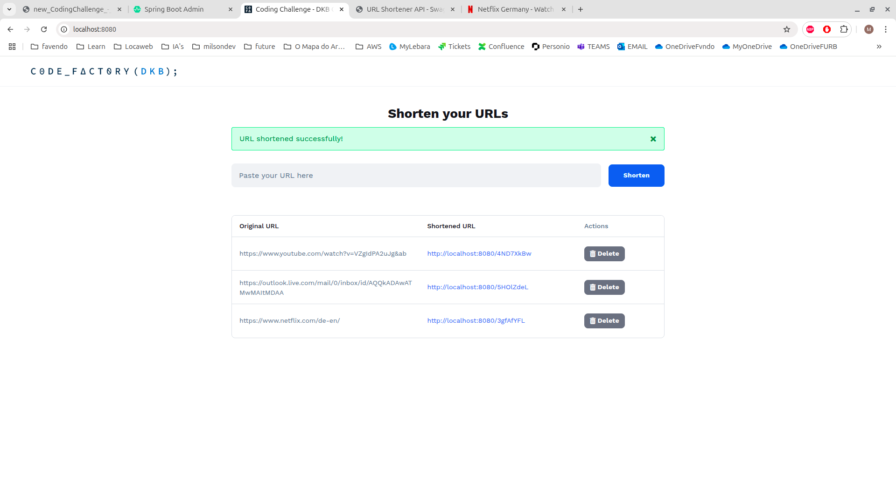
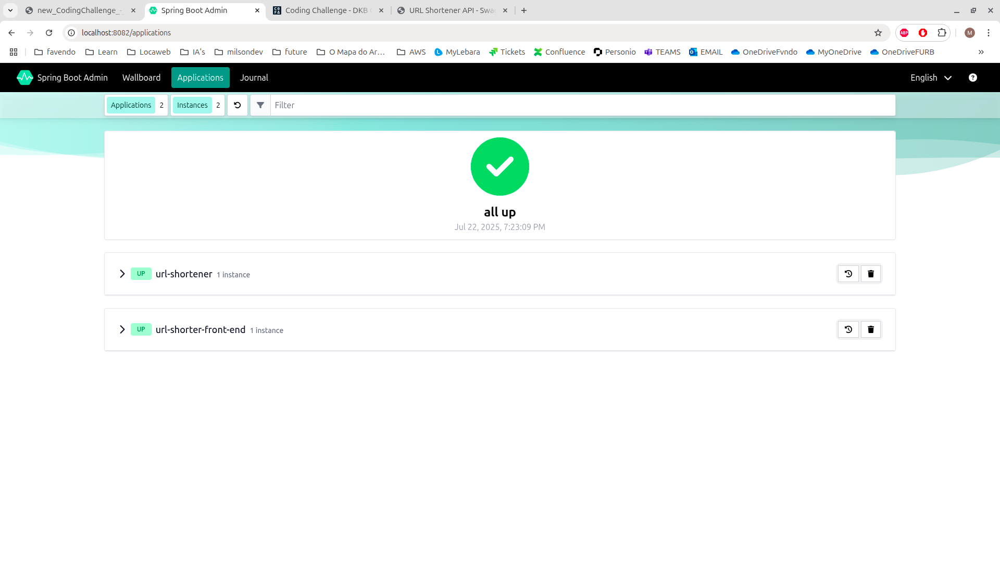

---

# Coding Challenge from the DKB Code Factory - URL Shortener

---

## 🚀 How to Run the Project

### 🔧 Requirements

To run the application in production mode, make sure the following tools are installed and configured:

* [Docker](https://www.docker.com/)
* [Docker Compose](https://docs.docker.com/compose/)

---

## 🌱 Project Profiles

The application is built with **three profiles**:

| Profile      | Description                                                                                                              |
| ------------ | ------------------------------------------------------------------------------------------------------------------------ |
| `local`      | Used for local development. Uses TestContainers.                                                                         |
| `test`       | Used for testing. Also runs on TestContainers.                                                                 |
| `prod` | Used for running the application in a production-like environment. **This is the profile recommended for the evaluator.** |

---

## ▶️ Running in Production Mode

From the **project root**, run:

```bash
docker-compose up --build
```

This will start the full stack, including optional services like the front-end and spring boot admin monitoring dashboard.

---

## 🧱 Stack Overview

The `docker-compose.yml` includes the following services:

| Service                                                                                                      | Description                                                     |
| ------------------------------------------------------------------------------------------------------------ |-----------------------------------------------------------------|
| `url-shortener` (main)                                                                                       | Core URL shortener backend. Built from local `Dockerfile`.      |
| [`url-shortener-front-end`](https://github.com/milson-antonio/url-shorter-front-end){\:target="\_blank"}     | Public front-end interface. Pulled directly from my Docker Hub. |
| [`spring-boot-admin-server`](https://github.com/milson-antonio/spring-boot-admin-server){\:target="\_blank"} | Public monitoring dashboard. Also pulled from my Docker Hub.    |

> ✅ Both `url-shortener-front-end` and `spring-boot-admin-server` are **public** and **do not require authentication** to pull from Docker Hub.
> 🛠️ The main `url-shortener` backend is built locally to facilitate quick edits during the evaluation.

---

## 🔗 Useful Endpoints

| Tool / Interface                   | URL                                                                                      |
| ---------------------------------- | ---------------------------------------------------------------------------------------- |
| 🌐 **Front-End UI**                | [http://localhost:8080/](http://localhost:8080/){\:target="\_blank"}                     |
| 📊 **Spring Boot Admin Wallboard** | [http://localhost:8082/wallboard](http://localhost:8082/wallboard){\:target="\_blank"}   |
| 📚 **Swagger API Docs**            | [http://localhost:8081/swagger-ui](http://localhost:8081/swagger-ui){\:target="\_blank"} |

---

## 📥 Clone the Project

To get started, clone the repository using:

```bash
git clone https://github.com/milson-antonio/url-shortener.git
```

---

## 🧪 Backend / Collection

If you'd like to **directly test the backend service (`url-shortener`)**, here are the available endpoints.

A Postman collection is also available in the project root under the filename: `dkb.postman_collection.json`. You can import directly into Postman to make testing easier.

### 🔗 Available Endpoints

1. **Create a new shortened URL**

    * `POST` [`http://localhost:8081/api/v1/urls`](http://localhost:8081/api/v1/urls)
    * **Payload:**

      ```json
      {
        "originalUrl": "https://www.youtube.com/watch?v=dQw4w9WgXcQ",
        "description": "description"
      }
      ```

2. **List all shortened URLs (paginated)**

    * `GET` [`http://localhost:8081/api/v1/urls?page=0&size=20`](http://localhost:8081/api/v1/urls?page=0&size=20)

3. **Return (front-end: redirect) original URL using short code**

    * `GET` [`http://localhost:8081/api/v1/urls/1p7ra5KL`](http://localhost:8081/api/v1/urls/1p7ra5KL)

4. **Delete URL by UUID**

    * `DELETE` [`http://localhost:8081/api/v1/urls/3bf394cb-9cee-4ddc-a01a-50f4b454fc4a`](http://localhost:8081/api/v1/urls/3bf394cb-9cee-4ddc-a01a-50f4b454fc4a)

---

## 📎 Related Repositories

* 🔗 **Front-End Repository**:
  [https://github.com/milson-antonio/url-shorter-front-end](https://github.com/milson-antonio/url-shorter-front-end){\:target="\_blank"}

* 📊 **Spring Boot Admin Server**:
  [https://github.com/milson-antonio/spring-boot-admin-server](https://github.com/milson-antonio/spring-boot-admin-server){\:target="\_blank"}

---

## 🖼️ Screenshots

Below are placeholders for screenshots demonstrating each part of the system:

### ✅ Swagger UI



---

### ✅ Front-End UI



---

### ✅ Spring Boot Admin



---

Thanks in advance, and let me know if you're having any problems running the project.
